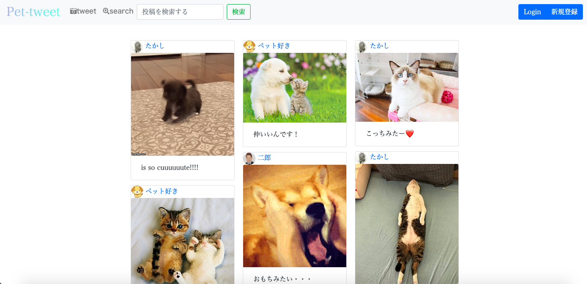
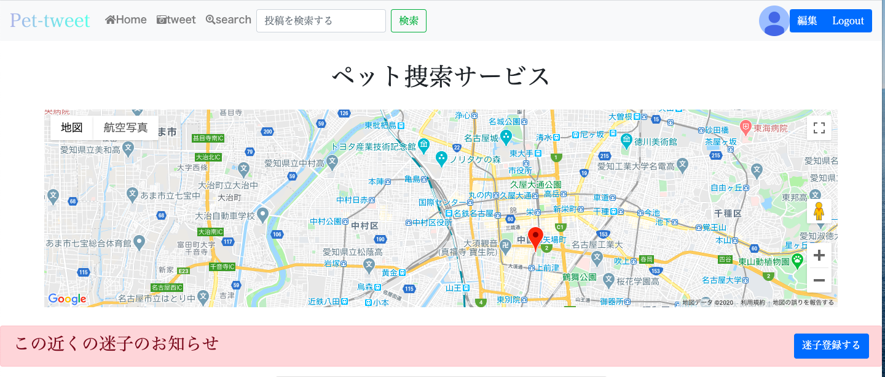
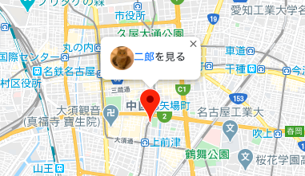

## http://pet-tweet.herokuapp.com/
# pet-tweet 

### 概要 
本アプリはペット専用のSNS型サイト 
自分の自慢のペットの写真を投稿して仲間とコミュニケーションが取れます！ 
google map apiを使用しペットを捜索できるサービスがあります！ 

### 本番環境
aws
testアカウント test_user@gmail.com 
testパスワード test_user 

### 制作背景
自分がペットを飼っていて、みんなと共有できるサイトが欲しかったのと、ペットが 
居なくなった時（逃げ出すなど）に役立つ捜索ができるサービスを作りたかったため。

### DEMO

「迷子登録をする」からペットの情報を記入すると、住所情報から経度、緯度を 
取得してマップ上にアイコンが立ちます。 
アイコンをクリックすると 
 
上のようにアイコンと名前が表示されて迷子になったペットの詳細ページへ飛ぶことができます。 

### 工夫したポイント
.トップページはできるだけシンプルにして、写真をブロック状に配置することによりお洒落で見やすいサイトにしました。 
また、user登録時写真を登録したくない人のためにデフォルト画像を用意しました。 

### 使用技術(開発環境)
.Ruby/Ruby on Rails/MySQL/Github/AWS/Visual Studio Code 

### 課題や今後実装したい機能
フォロー機能の実装、地域猫の登録とマップ表示。ペット飼っている人のためのアイテム紹介（amazon apiを使用し収益化)

### DB設計

## usersテーブル
|Column|Type|Options|
|------|----|-------|
|nickname|string|null: false|
|profile|string|
|image|string|
|email|string|null: false|
|password|string|null: false|

### Association
  has_many :tweets 
  has_many :comments 
  has_many :likes, dependent: :destroy 
  has_many :likes, dependent: :destroy 
  has_many :like_tweets, through: :likes, source: :tweet 
  has_many :pets 

## tweetsテーブル
|Column|Type|Options| 
|------|----|-------| 
|text|string| 
|image|string| 
|user_id|integer|null: false| 

### Association
  belongs_to :user 
  has_many :comments 
  has_many :likes, dependent: :destroy 
  has_many :liking_users, through: :likes, source: :user 

## petsテーブル
|Column|Type|Options|
|------|----|-------|
|image|string|null: false|
|user_id|integer|null: false|
|name|string|
|text|string|
|charactaristic|string|
|find|string|
|tell|string|
|address|string|null: false|
|latitude|float|null: false|
|longitude|float|null: false|
### Association
  belongs_to :user 
  geocoded_by :address 
  after_validation :geocode, if: :address_changed? 

## likesテーブル
|Column|Type|Options|
|------|----|-------|
|user_id|integer|null: false|
|tweet_id|integer|null: false|

### Association

## commentsテーブル
|Column|Type|Options|
|------|----|-------|
|user_id|integer|null: false, foreign_key: true|
|tweet_id|integer|null: false, foreign_key: true|
|text|string|
### Association
  belongs_to :tweet 
  belongs_to :user 

